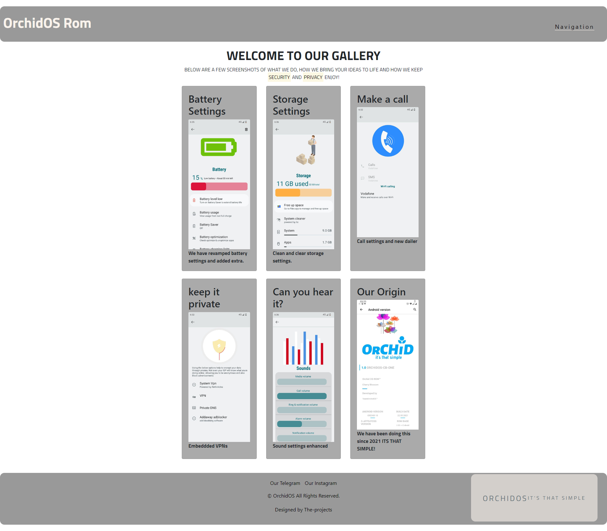

 

  <h1 align="center">OrchidOs Website</h1>
<h3 align="center">https://jaymestalabistudent.github.io/orchidos.github.io/</h3>

    

## Table Of Contents

* [About the Project](#about-the-project)
* [Repository Contents](#Repository-Contents)  
* [Testing for Accessibility](#Testing-for-Accessibility)  
* [Built With](#built-with)
* [Getting Started](#getting-started)
  * [Prerequisites](#prerequisites)
  * [Installation](#installation)
* [learn with the code](#learn-with-the-code)
* [Roadmap](#roadmap)
* [Contributing](#contributing)
* [License](#license)
* [Authors](#authors)
* [Acknowledgements](#acknowledgements)
Testing for Accessibility
## About The Project

The OrchidOS GitHub Pages repository serves as a platform to host and showcase the OrchidOS website. It functions as a comprehensive information hub delineating the essence of OrchidOS, its features, and avenues for community engagement and project involvement.

What is OrchidOs: OrchidOs is a Custom Rom company

Custom ROM companies play a pivotal role in the Android ecosystem, offering users a diverse array of options beyond the stock firmware provided by OEMs (Original Equipment Manufacturers). These companies embody the spirit of innovation, customization, and community-driven development, catering to the ever-evolving needs and preferences of Android enthusiasts worldwide.

Importance of Custom ROMs:
Custom ROMs serve as a gateway to a world of possibilities, enabling users to unlock the full potential of their devices. They offer a plethora of features and enhancements, including performance optimizations, customization options, privacy enhancements, and extended device support. By embracing open-source principles and collaborative development models, custom ROM companies empower users to take control of their devices and tailor their mobile experience according to their unique preferences.

Diversity of Custom ROM Companies:
The landscape of custom ROM companies is characterized by diversity, with a myriad of players contributing to the vibrant Android community. From well-established entities to emerging startups, each company brings its own distinct vision, expertise, and contributions to the table. While some companies focus on delivering feature-rich ROMs with extensive customization options, others prioritize stability, performance, or privacy-centric features.

Notable Players in the Custom ROM Scene:

LineageOS
Formerly known as CyanogenMod, LineageOS is one of the most prominent names in the custom ROM scene. With a rich heritage rooted in the early days of Android customization, LineageOS boasts a robust community of developers and contributors committed to delivering a stable and feature-packed ROM experience across a wide range of devices.

Paranoid Android
Paranoid Android is renowned for its innovative approach to user interface design and customization. With features like Pie Controls, Color Engine, and Dynamic System Bars, Paranoid Android has carved a niche for itself as a pioneer in user experience optimization and aesthetic refinement.

Pixel Experience
Pixel Experience aims to replicate the stock Android experience found on Google Pixel devices across a wide range of smartphones. With a focus on simplicity, stability, and performance, Pixel Experience provides users with a clean and minimalist Android experience reminiscent of Google's flagship devices.

OrchidOs is based on Pixel Experience.

Conclusion:
Custom ROM companies represent the epitome of community-driven innovation and collaboration in the Android ecosystem. By embracing open-source principles, fostering vibrant developer communities, and pushing the boundaries of mobile software, these companies continue to shape the future of Android customization and empower users to unlock the full potential of their devices. As users explore the diverse array of custom ROMs available, they embark on a journey of discovery, personalization, and empowerment in the world of Android customization. This what OrchidOs believes in and is based on. 
ITS THAT SIMPLE

OrchidOS represents a custom Android ROM tailored to prioritize user privacy, customization, and performance. It offers users an alternative mobile experience, empowering them to take control of their devices and personalize their smartphone experience according to their preferences and requirements. Key features of OrchidOS include:

Privacy Controls: OrchidOS includes robust privacy controls and features designed to protect user data, minimize tracking, and enhance privacy and security across the device and system.

Customization Options: OrchidOS offers extensive customization options and settings, allowing users to personalize their device's appearance, behavior, and functionality to suit their individual preferences and workflows.

Performance Enhancements: OrchidOS includes performance optimizations, tweaks, and enhancements aimed at improving device responsiveness, speed, and overall performance, even on older or lower-end hardware.

Regular Updates and Support: OrchidOS is committed to delivering regular updates, security patches, and feature enhancements to ensure that users have access to the latest innovations and improvements in the Android ecosystem.

Additionally, comprehensive support and documentation are provided to assist users with installation, configuration, and troubleshooting of OrchidOS on their devices.

## Repository Contents

HTML Files: These files encapsulate the structural blueprint and content architecture of the website pages.

CSS Files: This directory houses cascading style sheets responsible for defining visual aesthetics and layout structuring.

Video Files: This section encompasses background video assets utilized to enrich visual presentation and user engagement.

Images: This directory contains graphical assets and icons integrated throughout the website.

Wireframes: These graphical representations elucidate the layout and structural schematics of the website pages.

Features:

Responsive Design: The website is meticulously engineered to be responsive, ensuring seamless adaptability and optimal display across diverse devices and screen dimensions.

Video Integration: Background videos are seamlessly integrated to augment visual allure and user immersion.

Navigation: Intuitive navigation mechanisms, including dropdown menus, facilitate effortless traversal across different sections of the website.

Social Links: Integrated links to OrchidOS's social media platforms foster community interaction, outreach, and project visibility.

Testing Procedures:

Physical Device Testing: Physical testing on small mobile devices enables real-world evaluation of rendering fidelity and functional responsiveness.

Viewport Meta Tag Validation: Scrutinize the viewport meta tag configuration to ensure correct scaling and rendering behaviour on small screens.

Content Layout Optimization: Vigilantly examine content layout to mitigate issues of overflow, obscuration, or unintended display artifacts.

Touch Target Optimization: Verify adequacy of touch targets such as buttons and links to ensure optimal usability and user interaction on touch-enabled devices.

Testing Procedures for Responsiveness on Large Screens:

Viewport Scaling Analysis: Rigorous testing on large screens verifies scalability and rendering fidelity, guaranteeing content presentation consistency and visual appeal.

Media Query Evaluation: Thorough inspection of media queries ensures seamless adaptation of layout and styling attributes across varying viewport dimensions.

Grid System Integrity: Methodical examination of the website's grid system ensures proper alignment and spacing, facilitating optimal content presentation on large screens.

Image Optimization Analysis: Rigorous optimization of images and media assets ensures expedited loading times and pristine display quality on large screens.

## Testing for Accessibility

Screen Reader Compatibility Testing: Comprehensive compatibility testing with screen reader software such as Screen Reader for Google Chrome 0.8.0 ensures content accessibility for visually impaired users.

Semantic Markup Validation: Thorough validation of HTML markup ensures semantic accuracy and proper labeling of elements, enhancing accessibility and interoperability.

Keyboard Navigation Assessment: Detailed assessment of keyboard navigation functionality ensures seamless website traversal and interaction for users relying on keyboard input.

Focus Management Evaluation: Rigorous evaluation of focus management mechanisms ensures clear and consistent focus indicators and intuitive navigation pathways for keyboard users.

Bug Testing and Resolution example:

Issue: Experienced difficulties setting up the submit functionality on the comment form.

Resolution Process: Sought assistance from Stack Overflow, Reddit groups, and the Android developer group on Telegram.

Credit to ZachSaucier: Utilized a base code from ZachSaucier for the comment form, expanding and styling it to suit the website's requirements.

Base Code: ZachSaucier's CodePen

(other debug errors are labelled in the commit history and have been patched)

## Built With

The creation of the OrchidOS website wouldn't have been possible without the invaluable contributions of various individuals and resources: Here are a few examples.

* [Google Font: Utilized for typography enhancements.](https://fonts.google.com/)
* [Light house : accessibility testing ](https://chromewebstore.google.com/detail/lighthouse/blipmdconlkpinefehnmjammfjpmpbjk)
* [VSCode: Code editor for development.](https://code.visualstudio.com/)
* [GitHub Desktop: Version control tool for Git.](https://desktop.github.com/)
* [SetEdit (Android): Android-based text editor for coding on-the-go.](https://play.google.com/store/apps/details?id=by4a.setedit22&hl=en&gl=US)
* [Replit: Online IDE for collaborative coding.](https://replit.com/)
* [Media: All media assets were created by OrchidOS, except the main page video, sourced from Canva website.]()
* [Shaan Khan : Readme generation](https://github.com/Shaankhan101)
* [Progate : Github pages ](https://progate.com/docs/github-pages)
* [w3schools : bootstrap4 tutorials](https://www.w3schools.com/)
* [Grammerly : text population and wording](https://www.grammarly.com/)

## Getting Started

To manually deploy a website to GitHub Pages using GitHub Desktop and Visual Studio Code (VSCode), follow these steps:

### Prerequisites

1. Ensure you have GitHub Desktop and VSCode installed on your computer.
2. Have a GitHub account and a repository set up for your website.

### Installation

1. Clone Repository:
Open GitHub Desktop and clone your website repository to your local machine.
Click on "Clone a Repository from the Internet" and select your repository from the list.
Choose the local path where you want to clone the repository and click "Clone."

2. Develop and Test Locally:
Open the cloned repository folder in VSCode.
Make any necessary changes or updates to your website files.
Test your changes locally by opening the HTML files in a web browser.

3. Commit Changes:
In GitHub Desktop, you will see the changes you made to your files listed.
Write a brief summary and description of your changes in the commit message box.
Click on "Commit to main" to commit your changes to the main branch.

4. Push Changes to GitHub:
After committing changes, click on "Push origin" to push your changes to your GitHub repository.

5. Deploy to GitHub Pages:
Go to your GitHub repository on the GitHub website.
Click on the "Settings" tab.
Scroll down to the "GitHub Pages" section.
Under "Source," select the branch where your website's code resides (usually "main" or "master").
Click on "Save" to save your changes. GitHub Pages will then deploy your website.

6. Verify Deployment:
Once the deployment process is complete, a green status message will appear indicating that your site is published.
Click on the link provided to access your deployed website.

Conclusion:
By following these steps, you can manually deploy your website to GitHub Pages using GitHub Desktop and VSCode. This process allows you to efficiently manage your website's development, track changes, and deploy updates seamlessly to your GitHub Pages hosting environment.

## learn with the code

Clone the Repository:

1. Clone the OrchidOS GitHub Pages repository to your local machine using Git or GitHub Desktop. Use the following command if you're using Git:
bash
Copy code
git clone https://github.com/yourusername/orchidos.github.io.git
Replace yourusername with your GitHub username.
Install Development Tools:

2. Install necessary development tools such as Visual Studio Code (VSCode), GitHub Desktop, and any preferred text editors or IDEs.
Familiarize with the Repository Structure:

3. Explore the contents of the cloned repository. Take note of the HTML, CSS, and other files that comprise the website.
Open the Project in VSCode:

4. Open the cloned repository in VSCode or your preferred text editor/IDE.
Modify Configuration Files:

5. Review and modify configuration files such as index.html, style.css, and others to customize the website according to your requirements.
Add Content and Media Assets.

6. Add your content, images, videos, and other media assets to the appropriate directories within the repository.

7. Commit Changes:
Once satisfied with the modifications, commit your changes to the repository using Git or GitHub Desktop. Follow best practices for commit messages and version control.

## Roadmap

1. Define Goals and Objectives
Identify the purpose and target audience of the OrchidOS website.
Define specific goals and objectives for the website, such as showcasing features, promoting community engagement, and providing resources for users.

2. Research and Planning
Conduct market research to understand user needs, preferences, and industry trends.
Analyze competitor websites to identify strengths, weaknesses, and opportunities for differentiation.
Create a site map outlining the website's structure, navigation flow, and content organization.

3. Design and Mockup (wireframes are included in repo)
Develop wireframes and mockups to visualize the website layout, user interface elements, and content placement.
Choose a design style, color scheme, and typography that align with the OrchidOS brand identity and target audience preferences.
Iterate on the design based on feedback from stakeholders and usability testing.

4. Development
Set up the development environment, including version control systems, code editors, and development frameworks.
Build the website infrastructure using HTML, CSS, JavaScript, and any necessary front-end frameworks or libraries.
Implement responsive design principles to ensure the website is accessible and optimized for various devices and screen sizes.
Integrate interactive elements, animations, and multimedia content to enhance user engagement and experience.

5. Content Creation and Integration
Develop high-quality content, including text, images, videos, and graphics, that align with the website's messaging and objectives.
Optimize content for search engines (SEO) by incorporating relevant keywords, meta tags, and descriptive alt text for images.
Integrate content management systems (CMS) or backend solutions for dynamic content management and updates.

6. Testing and Quality Assurance
Conduct thorough testing of the website across different browsers, devices, and operating systems to identify and resolve compatibility issues.
Perform functionality testing to ensure all features, forms, links, and interactive elements work as intended.
Validate the website's accessibility and compliance with web standards, including WCAG guidelines for accessibility.

7. Deployment and Launch
Set up hosting infrastructure and domain registration for the website.
Deploy the finalized website to a production environment, ensuring proper configuration and security measures are in place.
Conduct a final round of testing and validation to confirm the website's readiness for launch.
Plan and execute a marketing and promotion strategy to generate awareness and drive traffic to the newly launched website.

8. Maintenance and Iteration
Monitor website performance, user engagement metrics, and feedback channels to identify areas for improvement.
Regularly update and maintain website content, features, and security patches to ensure optimal functionality and user experience.
Collect user feedback and iterate on the website based on evolving user needs, technological advancements, and industry trends.

## Contributing

Contributions are what make the open source community such an amazing place to be learn, inspire, and create. Any contributions you make are **greatly appreciated**.
* If you have suggestions for adding or removing projects, feel free to [open an issue](https://github.com/Jaymestalabistudent/orchidos.github.io/issues/new) to discuss it, or directly create a pull request after you edit the *README.md* file with necessary changes.
* Please make sure you check your spelling and grammar.
* Create individual PR for each suggestion.
* Please also read through the [Code Of Conduct](https://github.com/Jaymestalabistudent/orchidos.github.io/blob/main/CODE_OF_CONDUCT.md) before posting your first idea as well.

### Creating A Pull Request

1. Visit your forked repository on GitHub.

2. Click on the "New pull request" button next to the branch dropdown.
Select the base repository (orchidos/orchidos.github.io) and the base branch (usually main).

3. Select your forked repository and the branch containing your changes.

4. Review the changes in the pull request and provide a descriptive title and summary of the changes.

5. Click on the "Create pull request" button to submit your pull request.

## License

Distributed under the MIT License. See [LICENSE](https://github.com/Jaymestalabistudent/orchidos.github.io/blob/main/LICENSE.md) for more information.

## Authors

* **Shaan Khan** - *Comp Sci Student* - [Shaan Khan](https://github.com/ShaanCoding/) - *Built ReadME Template*

## Acknowledgements

* [ShaanCoding](https://github.com/ShaanCoding/)
* [Othneil Drew](https://github.com/othneildrew/Best-README-Template)
* [ImgShields](https://shields.io/)
